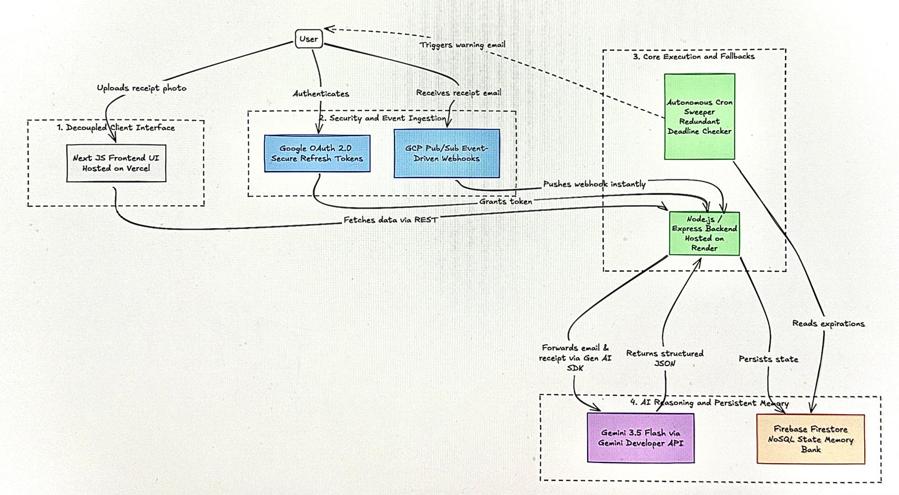

# ReturnMinder Architecture

[View interactive diagram on Excalidraw](https://excalidraw.com/#json=pk5l4Zv3f7aA23MlJ9Umh,nInwi02KRXe5rS-XKseKmg)

This document outlines the architectural decisions and system flow for ReturnMinder, specifically engineered to meet the requirements of the All Things Agentic Hackathon for The Taskmaster track.

## System Flow and Layer Breakdown

The system is completely decoupled into four distinct layers to ensure fault tolerance, scalability, and production readiness.

### 1. Decoupled Client Interface
The frontend is a React application built with Next.js and hosted on Vercel. By keeping the client fully decoupled from the execution backend, we ensure the user interface remains responsive and distinct from the heavy lifting of AI processing. 
Users interact with this layer to view their dashboard or manually upload photos of physical receipts for Multimodal UX processing.

### 2. Security and Event Ingestion
This layer handles incoming triggers without relying on inefficient polling mechanisms. 
* Google OAuth 2.0 provides secure authentication and issues refresh tokens to the backend.
* Google Cloud Pub/Sub serves as the event-driven ingestion engine. Whenever a user receives a receipt in Gmail, Google instantly pushes a webhook to our backend. This satisfies the requirement for Google Cloud Infrastructure.

### 3. Core Execution and Fallbacks
The central runtime of the application is a Node.js Express backend hosted on Render. 
* The backend acts as the orchestrator. It receives the instant webhook from Pub/Sub, processes the raw email or physical image, and forwards it to the AI layer.
* The Autonomous Cron Sweeper runs independently alongside the backend. It constantly audits the database for deadlines and pushes automated HTML warning emails back to the user.

### 4. AI Reasoning and Persistent Memory
This layer handles cognitive extraction and state management.
* Gemini 3.5 Flash acts as the extraction engine, accessed via the Gemini Developer API. The backend forwards raw emails or image files to Gemini using the Google Gen AI SDK. Gemini parses the unstructured data, extracts the exact return policy, and returns a strictly structured JSON object.
* Firebase Firestore acts as the persistent NoSQL memory bank. Once Gemini returns the JSON, the backend persists the state in Firestore. This ensures the autonomous cron sweeper always has an accurate ledger of expiring return windows to monitor.

